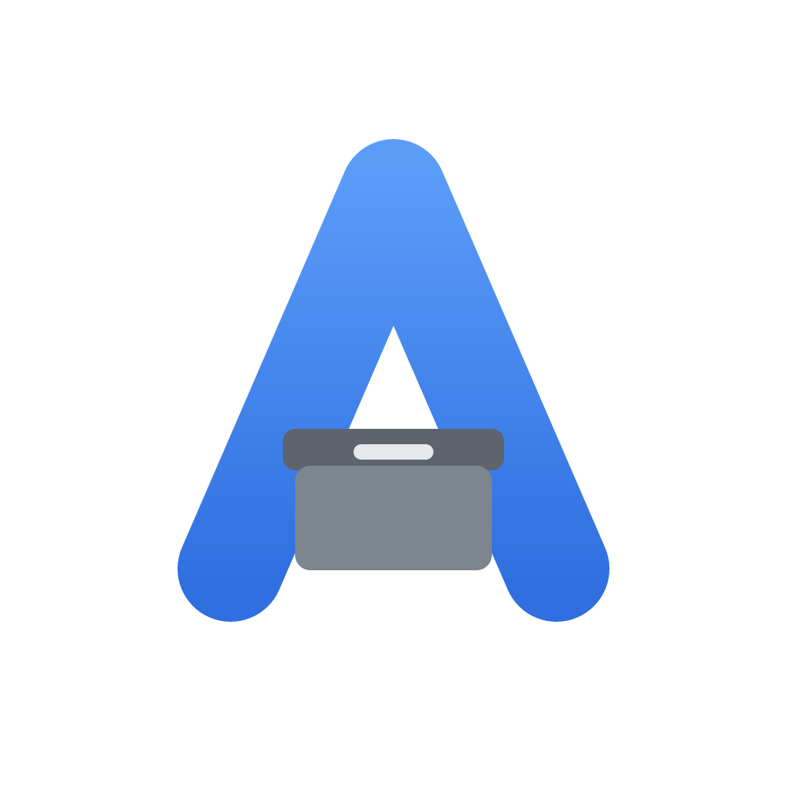

<p align="center">
  
</p>

<h1 align="center">Archivarr</h1>

<p align="center">
  <strong>Back up your media library to a rotating set of external drives — and always know what's protected, what isn't, and where every copy lives, even with nothing plugged in.</strong>
</p>

<p align="center">
  
  
  
  
  
</p>

Archivarr is a self-hosted, *arr-style backup/archive tracker for large media libraries.
It keeps a database of every file in your library and which backup drive(s) hold
each copy — so you can plan backups/archives and answer *"what would I lose if this drive
died?"* without any drives connected.

> **The problem it solves:** big libraries outgrow a single backup drive. Archivarr
> lets you fill one external drive after another, tracking exactly what's on each.
> When a drive fails, you know precisely which files were on it — and which other
> drives still have them.

---

## Features

- **Offline-first** — the database is the source of truth; reason about your
  backups with nothing plugged in.
- **Multi-drive rotation** — fill one drive, swap in the next; Archivarr copies
  only what isn't already backed up somewhere.
- **Per-file tracking** — every file knows which drive(s) hold its backup, and when.
- **Verified, safe copies** — files are content-hashed while copying, and Archivarr
  never overwrites or deletes anything it didn't put there.
- **Adopt existing backups** — already have copies on a drive? Import registers
  them instead of re-copying.
- **Recovery answers** — *"a source died: what's lost and where are the copies?"*
  and *"a destination died: re-queue its files for a new drive."*
- **Coverage at a glance** — dashboard and Media page show backed-up vs. pending,
  plus what's on each destination.
- **Background jobs** — scans and backups run with live progress, logs, cancel, and
  crash recovery; pause scheduled work whenever you like.
- **Locked down by default** — first run creates an admin login; an optional API
  key powers dashboards (Homepage / Homarr) and scripts.
- **Include / exclude filters** and a clean **light / dark** web UI.

---

## Quick start (Docker)

Archivarr runs as a single container. Create a `docker-compose.yml`:

```yaml
services:
  archivarr:
    image: ghcr.io/danbrown95/archivarr:latest
    container_name: archivarr
    ports:
      - "7979:7979"
    volumes:
      - ./config:/config              # database + settings
      - /path/to/your/media:/media:ro # your library (read-only)
      - /mnt:/mnt:rslave              # where your backup drives mount
    environment:
      - TZ=America/Chicago
    restart: unless-stopped
```

Start it and open <http://localhost:7979>:

```bash
docker compose up -d
```

On first visit you'll create an admin account. Then:

1. **Drives → Add source** — point it at your library (e.g. `/media`).
2. **Drives → Discover destinations** — plug in a backup drive and register it.
3. **Media → Scan sources** — index your library.
4. **Drives → Back up** — copy everything not yet backed up. When a drive fills,
   swap in the next and back up again.

> **Tips.** Mount your library **read-only** (`:ro`) — Archivarr only reads
> sources. Point the `/mnt` bind at wherever your system mounts external drives.
> And let Archivarr manage your backup drives: don't move, rename, or delete files
> (or the hidden `.archivarr/` folder) on them yourself.

Want to build from source instead of using the published image? See
**[CONTRIBUTING.md](CONTRIBUTING.md)**.

---

## Configuration

Most settings — include/exclude patterns, the auto-scan interval, your account, and
the API key — live in the in-app **Settings** tab. A few are environment variables:

| Variable | Default | What it does |
| --- | --- | --- |
| `ARCHIVARR_SCAN_ROOTS` | `/mnt` | Where to look for backup drives (comma-separated) |
| `TZ` | _system_ | Your timezone, for correct timestamps |
| `ARCHIVARR_PORT` | `7979` | Web UI / API port |
| `ARCHIVARR_CONFIG_DIR` | `/config` | Where the database and settings live |
| `ARCHIVARR_LOG_LEVEL` | `info` | Log verbosity: `debug` · `info` · `warn` · `error` |
| `ARCHIVARR_LOG_FORMAT` | `text` | Log output: `text` or `json` |
| `ARCHIVARR_WORKERS` | `4` | Background job worker pool size |
| `ARCHIVARR_MONITOR_INTERVAL` | `30` | Seconds between drive online/offline checks |
| `ARCHIVARR_AUTOMATION_PAUSED` | `false` | Start with scheduled work paused |

---

## How it works (in brief)

- A **source** is a library you protect; a **destination** is a rotating external
  drive that receives copies. Destinations are recognized by a small marker file,
  so they work at any mount path.
- A **scan** indexes a source (new / changed / removed files). A **backup** copies
  what isn't backed up yet to a destination, verifying each file by hash.
- The database remembers every source → destination copy, so coverage and recovery
  work even with the drives unplugged.

For the data model, tech stack, and design decisions, see
**[ARCHITECTURE.md](ARCHITECTURE.md)**.

---

## Support & community

- **Bugs & feature requests:** [GitHub Issues](https://github.com/DanBrown95/archivarr/issues)
  (please search first; one report per issue).
- **Questions, setup help & ideas:** [GitHub Discussions](https://github.com/DanBrown95/archivarr/discussions).
- **What's planned:** [`TODO.md`](TODO.md).
- **Support the project:** if Archivarr saves you a drive (or a headache), you can
  [sponsor on GitHub](https://github.com/sponsors/DanBrown95) or
  [buy me a coffee](https://www.buymeacoffee.com/danbrown95) — totally optional and
  genuinely appreciated.

This is an early, community-oriented project — feedback and contributions are very
welcome.

---

## Contributing

Code, docs, testing on real hardware, and ideas all help. See
**[CONTRIBUTING.md](CONTRIBUTING.md)** for the development setup and the
fork → feature-branch → pull-request workflow, and open an issue to discuss
anything substantial before a large PR.

## License

Released under the [MIT License](LICENSE).
